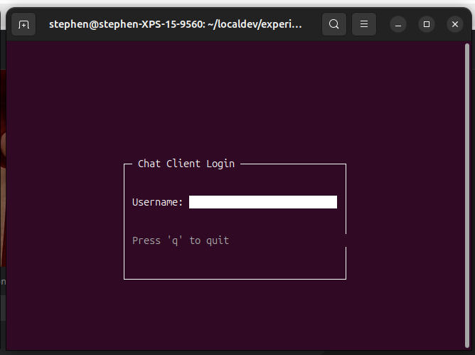
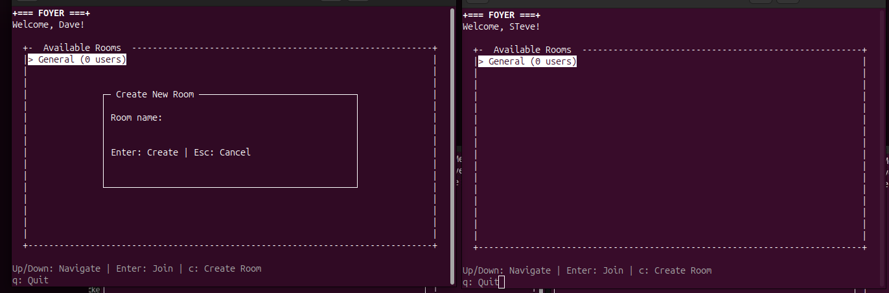
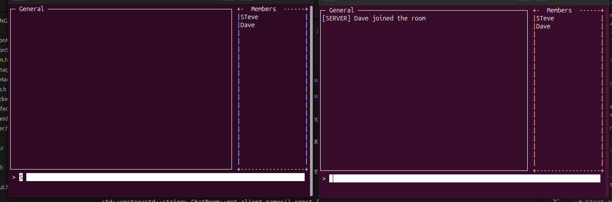

# Booking Chat System

A multi-threaded chat server and client application with a queue-based architecture for complete thread isolation.

## Screenshots

### Login Screen


### Foyer with Room Selection


### Chatroom with Member List


## Architecture

The system uses a **pure message-passing architecture** with three independent threads communicating through lock-free queues:

```
Network Thread ←→ Application Thread ←→ UI Thread
   (TCP I/O)      (Business Logic)     (ncurses)
```

See [ARCHITECTURE_REDESIGN.md](docs/ARCHITECTURE_REDESIGN.md) for detailed design documentation.

## Components

### Client
- **NetworkManager**: Pure TCP transport layer
- **ApplicationManager**: Protocol parsing and business logic
- **ApplicationState**: Single-threaded state management
- **UIManager**: ncurses presentation layer with component library
- **ThreadSafeQueue**: Lock-free queue for inter-thread communication
- **UI Components**: Widget-based UI library (Window, TextInput, Menu, Label, ListBox)

### Server
- **ServerSocket**: TCP server management
- **ClientManager**: Client connection handling
- **ChatRoom**: Room and message management with member tracking

## Building

```bash
mkdir -p build && cd build
cmake ..
make
```

Executables:
- `build/client` - Chat client
- `build/server` - Chat server
- `build/tests` - Unit tests (35 tests)

## Running

### Start Server
```bash
./build/server
```

### Start Client
```bash
./build/client
```

Or use the test script:
```bash
./test_new_client.sh
```

## Testing

### Unit Tests
```bash
./build/tests
```

Test coverage:
- ThreadSafeQueue: 15 tests
- NetworkManager: 8 tests
- ApplicationManager: 12 tests

### Manual Testing
```bash
# Single client
./test_new_client.sh

# Multi-client (open 2 terminals)
./test_multi_client.sh
```

## Client Usage

### Login Screen
- Type your name and press Enter
- Press 'q' to quit

### Foyer (Room List)
- Use ↑/↓ to navigate rooms
- Press Enter to join selected room
- Press 'c' to create a new room (opens dialog)
- Press 'q' to quit

### Chatroom
- Type message and press Enter to send
- Member list displayed on the right side
- `/leave` - Return to foyer
- `/quit` - Exit application

## Key Features

✅ **Non-blocking Architecture**: No thread ever blocks on another  
✅ **Zero Deadlocks**: Clean shutdown with Ctrl+C  
✅ **Immediate Updates**: No polling loops, instant room list updates  
✅ **Thread Safety**: Lock-free queues, single-threaded state  
✅ **Complete Separation**: Network, logic, and UI are independent  
✅ **Component-Based UI**: Reusable widget library for ncurses  
✅ **Member List**: Real-time display of room participants  
✅ **Room Creation**: Interactive dialog for creating new rooms  
✅ **Flicker-Free Rendering**: Double buffering for smooth UI updates

## Project Structure

```
.
├── src/
│   ├── client/
│   │   ├── client.cpp          # Main client entry point
│   │   ├── NetworkManager.*    # TCP transport layer
│   │   ├── ApplicationManager.* # Business logic layer
│   │   ├── ApplicationState.*   # State management
│   │   └── UIManager.*         # Presentation layer
│   ├── server/
│   │   ├── server.cpp          # Main server entry point
│   │   ├── ChatRoom.*          # Room management
│   │   ├── ClientManager.*     # Client handling
│   │   └── ServerSocket.*      # Server TCP socket
│   ├── ThreadSafeQueue.h       # Lock-free queue template
│   ├── UICommand.h             # UI command structures
│   └── RoomInfo.h              # Shared data structures
├── lib/
│   └── ui/                     # ncurses UI component library
│       ├── include/ui/
│       │   ├── Widget.h        # Base widget class
│       │   ├── Window.h        # Container with border
│       │   ├── TextInput.h     # Input field with cursor
│       │   ├── Menu.h          # Selection list
│       │   ├── Label.h         # Static text
│       │   └── ListBox.h       # Read-only list
│       └── src/
│           └── [implementations]
├── tests/
│   ├── ThreadSafeQueueTest.cpp
│   ├── NetworkManagerTest.cpp
│   └── ApplicationManagerTest.cpp
├── docs/
│   ├── images/                 # Screenshots
│   ├── ARCHITECTURE_REDESIGN.md
│   └── MIGRATION_COMPLETE.md
├── CMakeLists.txt
└── README.md
```

## Development

### Adding Features

**New UI Command:**
1. Add to `UICommandType` enum in `UICommand.h`
2. Add handler in `UIManager::process_commands()`
3. Generate command in `ApplicationManager`

**New Protocol Message:**
1. Parse in `ApplicationManager::process_network_message()`
2. Update `ApplicationState`
3. Generate appropriate UI commands

**New Network Transport:**
1. Implement interface matching `NetworkManager`
2. Use same queue references
3. No changes needed to Application or UI layers

### Testing

All components are unit tested in isolation:
- Create mock queues
- Push test data
- Verify output

See `tests/` directory for examples.

## Documentation

- [ARCHITECTURE_REDESIGN.md](docs/ARCHITECTURE_REDESIGN.md) - Complete design document
- [MIGRATION_COMPLETE.md](docs/MIGRATION_COMPLETE.md) - Migration summary and comparison
- [UI Component Library](lib/ui/README.md) - ncurses widget documentation
- [spec.md](docs/spec.md) - Original specification

## License

MIT

## Archive

Legacy event-based implementation is preserved in `archive/old_architecture/` for reference.
